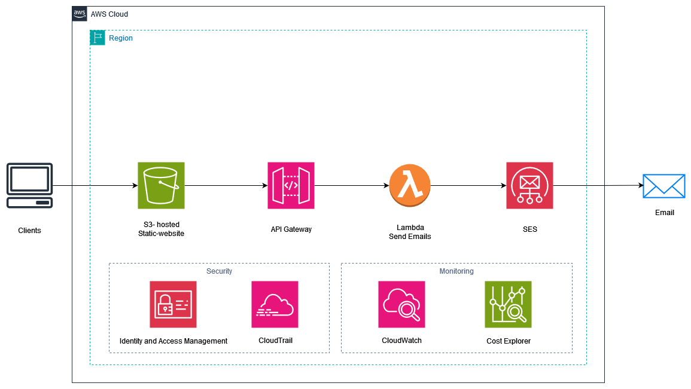

# AWS - Serverless Contact Form

This README will provide an overview of the system architecture. It will breifly describe each component.

## Table of Contents

- [Architecture Diagram](#architecture-diagram)
- [Components](#components)
  - [S3-hosted Website](#s3-hosted-website)
  - [API Gateway](#api-gateway)
  - [Lambda function](#lambda-function)
  - [Simple Email Service (SES)](#simple-email-service-ses)
  - [Security and Monitoring](#security-and-monitoring)
    - [Identity and Access Management (IAM)](#identity-and-access-management-iam)
    - [CloudTrail](#cloudtrail)
    - [CloudWatch](#cloudwatch)
    - [Cost Explorer](#cost-explorer)

## Architecture Diagram

## Components

### S3-hosted Website

The front-end of the application is hosted in an Amazon S3 bucket. The bucket is made publicly accessible and it is configured for website hosting.

### API Gateway

Amazon API Gateway is used to create the API that the front-end interacts with. It serves as the entry point for all API requests.

### Lambda Function

We have one lambda function, send emails, which is integrated with our only one API gateway endpoint (POST /send), it has a resourced-based policy attached to it that allows API gateway to call it, and has a role that permits it to call SES for sending the emails.

### Simple Email Service (SES)

Amazon SES is what is used to actually sending the emails.

### Security and Monitoring

#### Identity and Access Management (IAM)

IAM is used to manage permissions for resources and ensure secure access control. To adhere with the least privilege principle, a permission boundary is used where applicable.

#### CloudTrail

CloudTrail is enabled to log and monitor API activity across the AWS account.

#### CloudWatch

CloudWatch is used to monitor application performance, resource usage, and logs.

#### Cost Explorer

Cost Explorer is used to track and analyze the application's AWS usage and costs.